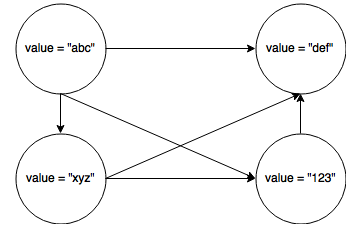

Functional programming is nothing new. It existed for a long time but recently became trending for its concise and declarative style. It is closer to mathematics than its counterpart, imperative programming, which makes it simple to reason about. This article is a basic introduction to the paradigm and I encourage you to dig in deeper. Learning FP will most likely contradict with what you believe in but keep in mind this is a completely different way of writing programs.

# Why ?

You may ask yourself why would you switch to functional programming. To answer that perfectly legitimate question properly, I think a look a object-oriented programming is needed.

Objects are states and behavior. Every OO programmer wrote some kind of DTO with multiple properties with getters and setters. On a high-level point of view, DTOs and any classifications of objects are state machines with a virtually infinite number of possible states and transitions (you may have business rules that prevent some properties to have illegal values).

This way of designing things makes problems complex to reason about and we end up writing a lot of unit tests to be sure that all the possible scenarios are handled.

Functional programming aims to write less code and be expressive. Testing functional code is also easier due to composition.

# Values

>  If you say that a is 5, you can't say it's something else later because you just said it was 5. What are you, some kind of liar?
>
> - learnyouahaskell.com/

The most important thing about values: they are **immutable**. When you give it a value, it can never be reassigned. This is a very important constraint and you will understand why when we get to functions.

  val title = "introduction to functional programming"
  val sam = User("sam", 4)

Data structures are immutable too. Updating a data structure usually leads to create a new instance of the data structure type with the updated state. Here is an example with lists:

  val canadianCities = List("Montreal", "Quebec", "Toronto")
  val americanCities = List("New York", "Los Angeles")
  val northAmericanCities = canadianCities ++ americanCities;

The list `northAmericanCities` is a new list created from the operation of combining `canadianCities` and `americanCities`. Appending two lists to return a new one of done by sharing data, which means that no data was cloned but it was rather reused. Immutability makes passing values as parameter to functions safe since it is guaranteed it is never modified.

# Functions

This is the interesting part ;-). Functions are first-class citizens in FP.

First of all, let me take you back your highs chool mathematic classes:

  f(x) = y

Always, always, always, always, always. Idempotence is the law in functional programming. This is, in part, a consequence of immutability.

But what are functions? Functions are operations that take arguments and produce a result. A function is pure when it has no side-effects. A few examples of side effects are:

- Change an external state
- Modify a value
- Throw an exception
- Read from a standard input
- Write to disk

Some of you might be skeptical about the usefulness of FP after reading that, but those constraint should not make you back off.

> Functional programming is a restriction on how we write programs, but not on what we express.
>
> - Paul Chiusano and Rúnar Bjarnason - Functional Programming in Scala

## Some alternatives to side-effects

### Changing an external state or a value

Just don't do it ;-). When programming in FP, your goal is to minimize as much as possible this kind of side-effects.

### Throwing an exception

The first possibility would be to return a sentinel value. For example, if your function return -9999 or null, you know an error occured. That being said, doing that will give you no information of what happened and you will have to have checks everytime you call the functions which is not desirable if you want to write less code.

The second possibility is to return an `Option` value.

  def parseInt(s: String): Option[Int]
  ...
  val parsed = parseInt(myNumber) getOrElse 0

An `Option` value wraps the result and offers methods to operate on the return value even if the wrapped value is null. Scala `Option` type has the follow functions:

- `map`
- `get`
- `getOrElse`
- and many more

A third possibility is to return a `Either` value. An `Either` is just a tuple that will hold either the result or the error.

  def parseInt(s: String): Either[Exception, Int]

This means that the function will either return an exception (and not throw it) or the result. By convention, the result is the one on the right (based on a pun: the right value).

### IO

This is a complex subject. I will eventually write a blog post about it but I encourage you to read [this article on Wikipedia](http://en.wikipedia.org/wiki/Monad_%28functional_programming%29#The_I.2FO_monad).

## Avoid loops, use recursion.

Here is a function that returns the nth Fibonnacci number:

  def fibonnacci(n: Int): Int = {
    @tailrec
    def loop(n: Int, previous: Int, current: Int): Int = {
      if (n == 0) previous
      else loop(n - 1, current, current + previous)
    }
  }

I want to point out a few things here. You will notice the presence of an accumulator `current`. You will also notice the @tailrec annotation. This is important because in order to be optimal your function must be a tail recusive function. In short, tail recursion means that the last operation executed must be the recusive call. This allows the compiler to write your function with the same bytecode as a while loop. Some of you will say "Well, I can write a while loop then." and the answer is *nope*. A while loop means that you will have to mutate a certain value at some point which is exactly what you do not want.

For example, here is the same Fibonnacci function in javascript without tail-recursion:

  function fibonnacci(n) {
    if (n < 2 ) {
      return 1
    } else {
      return fibonnacci(n - 2) + fibonnacci(n - 1)
    }
  }

See anything different here (beside the language) ? The last operation executed will be the addition and this is why it is not considered as a tail-recursion.

## High order function

Functions that take functions as parameters and/or return functions are called high order functions. It is very useful to pass in custom behavior. It also allows functions to be composed. Here are a two examples that speak by themselves:

  val l = List(1, 2, 3, 4);
  val mapped = l.filter(e => e % 2 == 0).map(_ * 2) // Take only even numbers and multiply them by 2

  def isOrdered[A](as: Array[A], ordered: (A, A) => Boolean): Boolean = {
    def loop(n): Boolean {
      if (n >= as.length - 1) true
      else if (!ordered(as(n), as(n + 1))) false
      else loop(n + 1)
    }

    loop(0)
  }

  val orderedIntegers = Array(1, 2, 3, 4, 5)
  val unOrderedIntegers = Array(1, 2, 4, 3, 5)

  def intOrdered(x: Int, y: Int) =  x <= y

  val isFirstArrayOrdered = intOrdered(orderedIntegers, intOrdered))
  val isSecondtArrayOrdered = intOrdered(unOrderedIntegers, intOrdered))

High-order function really shines when using combinators such as `map`, `flatMap`, `filter`, etc.

# Summary

- Treat everything as immutable.
- Avoid as much as possible side-effects.
- Functions are first class citizens.
- Use recursion.
- High-order functions enables passing behavior.

# Resources

- [Félix-Étienne Trépanier - Confoo slides](http://www.slideshare.net/felixtrepanier/intro-to-functional-programming-confoo)
- [Martin Odersky - Functional Programming Principles in Scala](https://www.coursera.org/course/progfun)
- [Miran Lipocava - Learn you a Haskell for Great Good !](http://learnyouahaskell.com/)
- [JavaScript allongé](https://leanpub.com/javascriptallongesix)
- [Paul Chiusano and Runr Bjarnason - Functional Programming in Scala](http://www.manning.com/bjarnason/)
